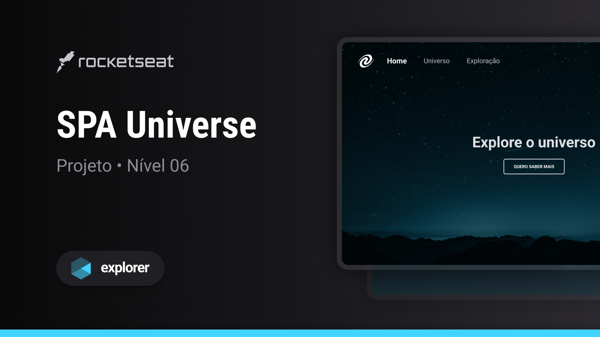

<h1 align="center">SPA Universe</h1>

  Projeto retirado do programa Explorer, um programa de estudo exclusivo promovido pela Rocketseat para o ensino de tecnologias web.

  <a href="#-layout">Layout</a>&nbsp;&nbsp;&nbsp;|&nbsp;&nbsp;&nbsp;
  <a href="#-aprendizado">Aprendizado</a>&nbsp;&nbsp;&nbsp;|&nbsp;&nbsp;&nbsp;
  <a href="#-projeto">Projeto</a>&nbsp;&nbsp;&nbsp;|&nbsp;&nbsp;&nbsp;
  <a href="#-tecnologias">Tecnologias</a>&nbsp;&nbsp;&nbsp;|&nbsp;&nbsp;&nbsp;
  <a href="#-licença">Licença</a>

 

  

 

  

## 🎨 Layout

Você pode visualizar o layout do projeto através [DESSE LINK](https://www.figma.com/file/m8zp3mtxvwyTGQs69nIFM8/%5BDesafios-Explorer%5D-SPA-Universe/duplicate).

## 📖 Aprendizado

- Adquiri conhecimentos sobre os fundamentos do SPA (Single Page Application);
- Dominei o conceito de mapeamento de rotas;
- Desenvolvi uma compreensão sobre orientação a objetos;
- Explorei o funcionamento de operações assíncronas e o uso de promises.

## 💻 Projeto

O propósito central do desafio "SPA Universe" residia na criação de uma Single Page Application (SPA) que incorporasse os princípios da Programação Orientada a Objetos (POO), implementação eficaz de mapeamento de rotas, juntamente com a aplicação hábil de operações assíncronas e o aproveitamento de promises.

## 🧪 Tecnologias

Esse projeto foi desenvolvido com as seguintes tecnologias:

- [HTML](https://developer.mozilla.org/pt-BR/docs/Web/HTML)
- [JavaScript](https://developer.mozilla.org/pt-BR/docs/Web/JavaScript)
- [Tailwind CSS](https://tailwindcss.com)

## 📝 Licença

Este projeto está sob a licença MIT. Consulte o arquivo [LICENSE](https://github.com/kauankarvalho/SPA-Universe/blob/main/LICENSE) para obter mais detalhes.
